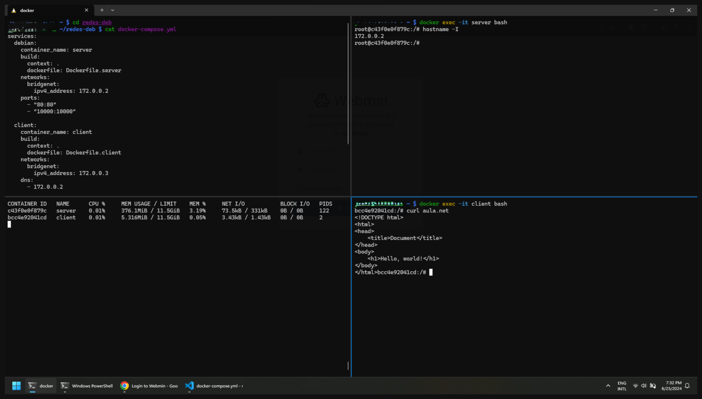
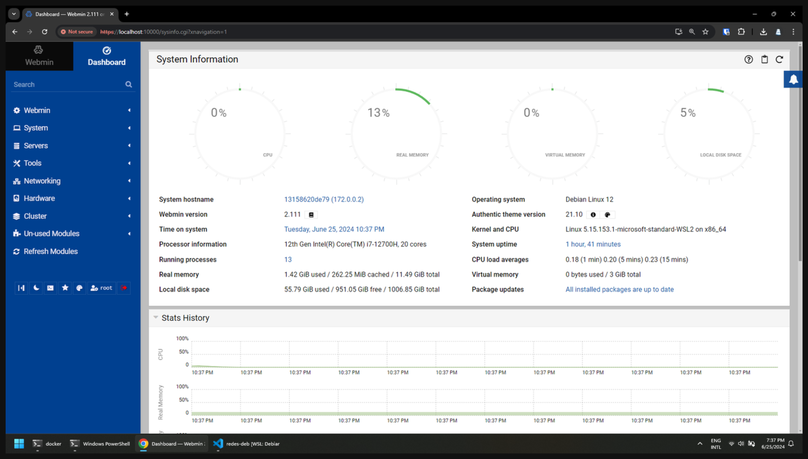

# DNS Bind9 + Apache + Webmin


Containers rodando


Webmin rodando

### Para executar
```console
$ docker compose up -d
```

### Inspecionar o container `client` e requisitar `aula.net`
```console
$ docker exec -it client bash
/# curl aula.net
```